# Sentinel

A local-first security intelligence engine for humans and AI coding agents.
Audit code, follow cross-function input flows, retrieve ranked security context,
and verify patches through a persistent graph, CLI, TUI, or stdio MCP.
The default scan uses 22 embedded rules and requires no external scanner or network.

Recent security checklist improvements include audit findings for permissive CORS,
unverified JWT decoding, and explicitly enabled Python debug servers. These checks
identify review points; JWT decoding for display and permissive CORS for public
resources may be intentional. Existing graph analysis traces XSS, SQL injection,
command injection, and path traversal. CI actions are pinned to immutable commits,
checkout credentials are not retained, token permissions are read-only, and jobs
have a 20-minute limit.

MFA, password reset, webhook replay protection, rate limiting, upload policies,
and business logic require application-specific threat modeling and runtime tests.
Sentinel is a local CLI and does not provide those application services. AI output
remains advisory and is never executed or used to override deterministic findings.
Optional Semgrep/Bandit scans and AI explanations must be requested explicitly.
Explain findings or the codebase with local Ollama, NVIDIA NIM, or both models
concurrently using the same context snapshot.

Sentinel is currently suitable for evaluation and controlled pilots. Its rule
coverage and approximate taint analysis have not been independently benchmarked;
a successful scan is not a guarantee that a project has no vulnerabilities.

Implementation of the [competitive roadmap](docs/competitive-roadmap.md) has started
with a [reproducible CLI benchmark](benchmarks/README.md). Its 26 development cases
measure labelled rule behavior; they do not establish production accuracy or a
competitive advantage.

## Contents

- [Terminal workspace](#terminal-workspace)
- [Security intelligence and agents](#security-intelligence-and-agents)
- [Evidence-based audit workflow](#evidence-based-audit-workflow)
- [Patch verification and baselines](#patch-verification-and-baselines)
- [Build and run](#build-and-run)
- [Changed-file scans](#changed-file-scans)
- [Optional external scanners](#optional-external-scanners)
- [Persistence and explanations](#persistence-and-explanations)
- [Hybrid AI and codebase explanations](#hybrid-ai-and-codebase-explanations)
- [Rule dialect](#rule-dialect)
- [Architecture](#architecture)
- [Scan execution](#scan-execution)
- [Rule execution](#rule-execution)
- [Database model](#database-model)
- [Finding lifecycle](#finding-lifecycle)
- [Verification](#verification)

## Build and run

```sh
cargo build --release --bin sentinel
sentinel audit /path/to/project
sentinel audit /path/to/project --format json
sentinel audit /path/to/project --format sarif --threshold high
sentinel audit /path/to/file.rs
sentinel rules
sentinel tui /path/to/project
sentinel index /path/to/project
sentinel verify /path/to/project
sentinel mcp --repository /path/to/project
```

`--format` accepts terminal, json, or sarif. JSON and SARIF go to stdout without
terminal decoration. Reports expose completion status and coverage notes.

Exit codes:

- 0: complete scan with no findings at or above the threshold.
- 1: complete scan with findings at or above the threshold.
- 2: failed or incomplete scan, including persistence failure.

The default threshold is info. `--threshold` accepts info, low, medium, high,
or critical. A higher threshold changes the exit code, not the findings returned.
An incomplete scan takes precedence over findings when choosing the exit code.

## Changed-file scans

```sh
sentinel diff
sentinel diff --staged --format json
sentinel diff --unstaged --format sarif
sentinel diff --tracked-only
```

Default diff selects staged changes, unstaged changes, and untracked files.
`--staged` and `--unstaged` select only that tracked change category.
`--tracked-only` excludes untracked files from the default selection.
Paths resolve from the repository root, including when invoked in a subdirectory.
Deleted tracked files are not read; complete diff coverage can resolve their
previous findings. External scanners receive the selected files, not the whole project.

## Optional external scanners

```sh
sentinel audit . --external-scanners
sentinel audit . --external-scanners --semgrep-config ./my-semgrep-rules.yml
sentinel diff --external-scanners --semgrep-config ./my-semgrep-rules.yml
```

Only Semgrep and Bandit are supported. Semgrep requires a local configuration
file or directory written in Semgrep's dialect. Sentinel's bundled rule files
are not a full Semgrep-compatible configuration. Semgrep metrics and version
checks are disabled. Bandit runs only on selected Python files.

Each available scanner has a separate completion result. Missing optional
scanners are recorded as unavailable; requesting external scans with no
applicable available scanner marks the scan incomplete. Malformed or partial
scanner output also marks the scan incomplete while retaining valid findings.

The subprocess timeout defaults to 60 seconds and is configurable with
`--scanner-timeout`. Stdout is limited to 8 MiB and stderr to 64 KiB.
A source file larger than 10 MiB is reported as incomplete coverage.
Syntax errors and excessive syntax nesting are reported rather than treated as
clean source. Unsupported languages and binary files are identified as skipped.

## Persistence and explanations

Each project stores `.sentinel.db` in its audited directory. A single-file
audit stores it beside the file. `--db` overrides the database used by audit,
diff, or either explanation command.

```sh
sentinel explain FINDING_ID --project /path/to/project
sentinel explain FINDING_ID --db /path/to/.sentinel.db
```

Finding explanation requires an existing database and finding. Its default
provider is LM Studio/Bionic at localhost:1234/v1 with model qwen/qwen3.5-9b; the model and endpoint
are configurable. Before calling AI, the shared project context is stored in the
database's `memory` table. Codebase explanation can create a database without a
prior scan. `--context-only` previews the payload without provider requests or
database writes. A failed provider returns exit `2`; successful responses from
other requested providers are preserved.

Schema upgrades, findings, and scan records are transactional. SHA-256
fingerprints identify occurrences by normalized file path, line, category,
rule title, and evidence (including columns when available). Repeated scans
update the same current occurrence. Scan
snapshots preserve history. Complete coverage resolves missing occurrences;
incomplete scans never resolve old findings, and diff resolves only selected files.
Full scans preserve findings in existing files that were skipped or not analyzed;
they can resolve findings in analyzed files and files deleted from the target.
Reappearing occurrences become active again. Moving an occurrence to another
line or column gives it a new identity.

## Hybrid AI and codebase explanations

Use `explain` for a persisted security finding, or `explain-codebase` to understand
a project without first auditing it. Both commands support a custom question.

```sh
# Local model only
sentinel explain-codebase . --provider local --local-model llama2

# Inspect the exact shared context and messages without calling AI
sentinel explain-codebase . --context-only

# Ask about a specific part of the project
sentinel explain-codebase . --question "How do findings reach the database?"

# Cloud only, or both providers concurrently
sentinel explain-codebase . --provider nim --nim-model YOUR_NIM_MODEL_ID
sentinel explain-codebase . --provider both --nim-model YOUR_NIM_MODEL_ID --json

# The same provider choices apply to finding explanations
sentinel explain FINDING_ID --project . --provider both --nim-model YOUR_NIM_MODEL_ID
```

Choose a model ID available in your NVIDIA account. Sentinel uses NVIDIA's
[chat-completions API](https://docs.api.nvidia.com/nim/reference/llm-apis) with
base URL `https://integrate.api.nvidia.com/v1` and bearer authentication.
Set the key in the process environment, rather than passing it on the command line:

```powershell
# PowerShell: enter the key without putting it in shell history
$nimCredential = Get-Credential -UserName NVIDIA -Message "Enter your NVIDIA API key as the password"
$env:NVIDIA_API_KEY = $nimCredential.GetNetworkCredential().Password
$env:SENTINEL_NIM_MODEL = "YOUR_NIM_MODEL_ID"
sentinel explain-codebase . --provider both --json
```

| Option | Environment variable | Default |
| --- | --- | --- |
| `--provider` | — | `local`; accepts `local`, `nim`, `both` |
| `--local-model` | `SENTINEL_LOCAL_MODEL` | `qwen/qwen3.5-9b` |
| `--local-endpoint` | `SENTINEL_LOCAL_ENDPOINT` | `http://localhost:1234/v1` |
| `--nim-model` | `SENTINEL_NIM_MODEL` | `z-ai/glm-5.3` |
| `--nim-endpoint` | `SENTINEL_NIM_ENDPOINT` | `https://integrate.api.nvidia.com/v1` |
| `--nim-key-env` | Names the key variable | `NVIDIA_API_KEY` |
| `--ai-timeout` | — | `180` seconds per provider |
| `--context-bytes` | — | `12000`; range `1024`–`65536` |
| `--context-only` | — | Preview only; no model or key required |
| `--question` | — | Architecture overview or finding explanation |
| `--json` | — | Structured responses and failures |

CLI values take precedence over environment configuration. There is **no
automatic fallback**: `local` calls only the configured local server, `nim` calls only NVIDIA NIM,
and `both` calls both concurrently. Each answer is labeled with provider, model,
and context ID. If one fails, the other answer remains available and the command
returns exit `2`. No model arbitrates or silently merges the answers.

### Shared context architecture

One request builds one immutable context bundle and one system/user message
sequence. Both providers receive identical messages, including the same source
evidence and question. The providers still have independent native token windows
and inference state; Sentinel shares the input evidence rather than model memory.

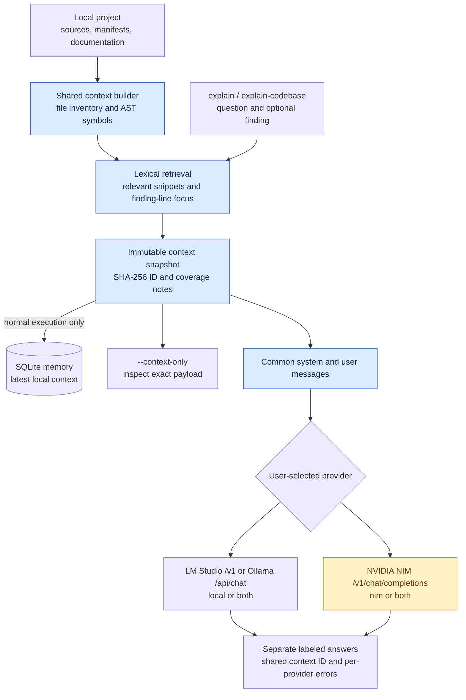

The context includes project-relative paths, content hashes, symbol locations,
and numbered source excerpts. Finding explanations prioritize the affected file
and line. Context is rebuilt from current files for each request; its ID changes
when the included evidence changes. `memory["ai.context.latest"]` stores the
latest bundle locally, independent of provider choice. This is evidence sharing,
not a persistent multi-turn chat session or a vector database.

Retrieval considers at most 256 eligible files, reads files up to 256 KiB, and
uses a bounded source-read budget of roughly 4 MiB. It selects up to 20 excerpts,
each capped at 40 lines and 2500 bytes, then fits them and the inventory into
the configured context-byte budget. Large repositories can have partial context;
coverage notes describe truncation and indexing failures. Increase the byte
budget only within the selected models' context limits: byte budgets are not
token budgets. Ollama requests an 8192-token context window and up to 2048 output
tokens; NIM requests up to 2048 output tokens.

The builder honors the project walker exclusions, omits hidden and known
credential/key filenames, and rejects paths resolving outside the project root.
It does **not** guarantee secret redaction inside ordinary source or documentation.
`nim` and `both` send the included context and finding to the configured cloud
endpoint. Use the preview to inspect that evidence. API key configuration is not
stored in SQLite, included in prompts, or printed in provider diagnostics.

AI answers are advisory. The prompt requests source citations and separates
evidence from inference, but citations and claims still need review. AI output
does not modify code, create scan findings, change finding resolution, or execute
repository instructions. HTTP requests have timeouts, response bodies are capped
at 2 MiB, redirects are disabled, and incomplete model responses are reported as
provider failures.

## Rule dialect

Rules are validated and compiled when loaded. Supported selectors are:

- `pattern`: literal code or a call/block pattern with `...` wildcards.
- `pattern-regex`: regex against executable AST nodes for code-language rules.
- `languages: [regex]`: explicit text matching, including strings and comments.
- `patterns` and `pattern-either`: conjunction and alternatives over candidates.
- `pattern-not`, `pattern-not-regex`, `pattern-inside`, and
  `pattern-not-inside`: exclusions and AST context constraints.
- `mode: taint`: JavaScript/TypeScript source-to-sink analysis with simple
  structural source, sink, and sanitizer names.

Conjunctions must match overlapping candidates. They do not associate unrelated
expressions elsewhere in a file. Plain code selectors ignore comments and
string-only matches. Regex-language rules intentionally search text.

The dialect does not implement Semgrep metavariable binding, focus-metavariable,
metavariable-pattern, or Semgrep string-regex syntax. Unsupported keys and
patterns, invalid regexes, duplicate IDs, and missing positive selectors are
rejected with diagnostics. Taint rules require nonempty supported sources/sinks;
they are never silently discarded.

Embedded-rule taint analysis handles identifier assignments, lexical shadowing, captured
bindings, conservative branch joins, and loop fixed points. Sanitizers affect
only the expression they transform. Function-parameter audit rules use the
explicit `@parameter` source. Analysis is approximate: it does not resolve module
imports, compute general interprocedural summaries, or precisely distinguish
object fields and dynamic aliases. Generic execution calls and environment
reads are audit signals, not proof of exploitability. Remaining unsupported
language features and complex control flow require manual review.

Bundled rules are generated at build time; collecting unreadable or missing
assets fails the build. Add or edit YAML under crates/sentinel-scanner/rules,
then rebuild. `sentinel rules` lists the loaded catalog without requiring a scan.

## Architecture

The CLI owns command routing, persistence, output, and process exit codes. The
scanner returns a result rather than exiting the process, so the same pipeline
can serve audit, diff, and the interactive TUI. The diagram shows runtime data
flow; arrows do not represent the complete Cargo dependency graph.

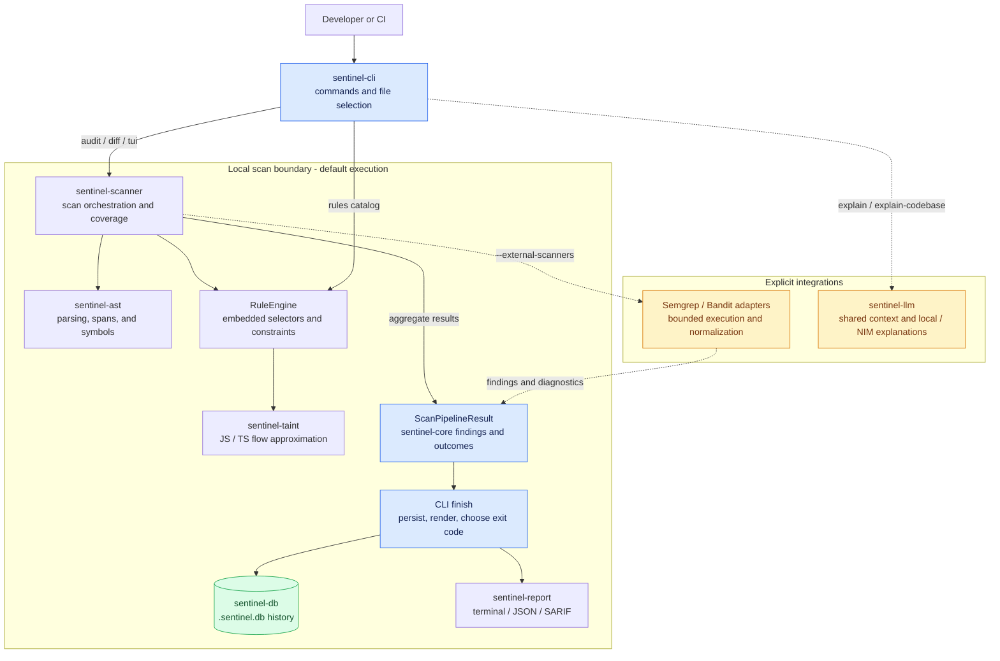

Solid arrows show local scan orchestration. Dashed arrows show
explicit integration paths. External scanners are local processes; their own
configuration determines any additional behavior. AI providers are contacted
only by explanation commands, using the explicitly selected provider mode.

| Crate | Responsibility | Main implementation |
| --- | --- | --- |
| `sentinel-cli` | Commands, file selection, persistence, rendering, exit codes | [main.rs](crates/sentinel-cli/src/main.rs), [scan.rs](crates/sentinel-cli/src/scan.rs), [diff.rs](crates/sentinel-cli/src/diff.rs) |
| `sentinel-core` | Shared findings, severity, fingerprints, and completion models | [models.rs](crates/sentinel-core/src/models.rs) |
| `sentinel-ast` | Walking, language detection, parsing, spans, and symbols | [lib.rs](crates/sentinel-ast/src/lib.rs), [ast_query.rs](crates/sentinel-ast/src/ast_query.rs) |
| `sentinel-taint` | Lexical environments and approximate source-to-sink tracking | [lib.rs](crates/sentinel-taint/src/lib.rs) |
| `sentinel-scanner` | Embedded rule execution, adapters, and coverage aggregation | [pipeline.rs](crates/sentinel-scanner/src/pipeline.rs), [rules.rs](crates/sentinel-scanner/src/rules.rs) |
| `sentinel-db` | Versioned SQLite migration, current findings, and snapshots | [lib.rs](crates/sentinel-db/src/lib.rs) |
| `sentinel-report` | Terminal, JSON, and SARIF serializers | [lib.rs](crates/sentinel-report/src/lib.rs) |
| `sentinel-llm` | Shared project evidence and concurrent Ollama/NIM explanation requests | [lib.rs](crates/sentinel-llm/src/lib.rs), [context.rs](crates/sentinel-llm/src/context.rs) |

## Scan execution

Audit walks a target; diff constructs an explicit file set from Git. Both enter
the same pipeline. An empty diff stays empty rather than falling back to a full
project scan. Source failures accumulate coverage notes while other files can
still produce findings.

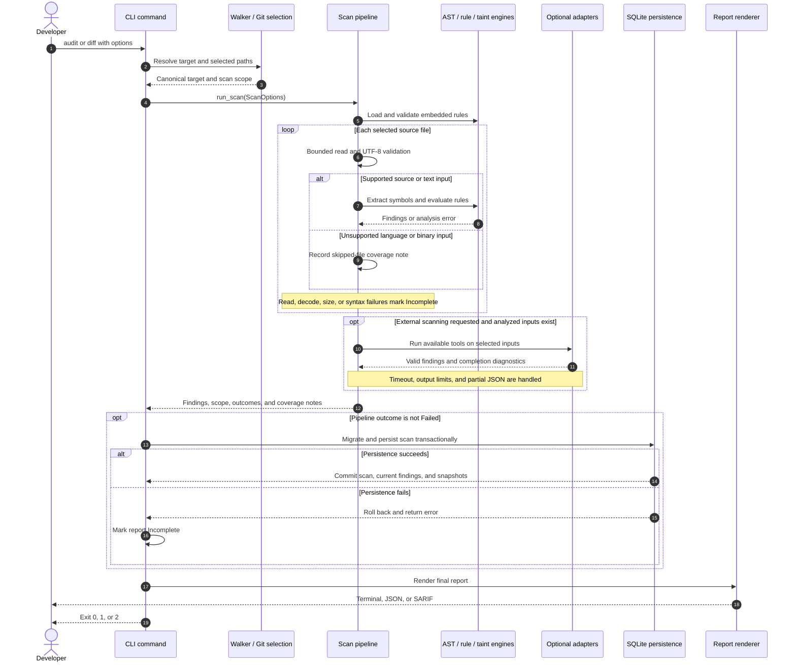

| Final condition | Exit | Meaning |
| --- | --- | --- |
| Complete, no finding meets the threshold | `0` | Scan completed within its reported scope |
| Complete, at least one finding meets the threshold | `1` | Findings need review |
| Incomplete or Failed | `2` | Coverage or execution failed; inspect diagnostics |

Skipped-file notes must still be reviewed: `Complete` describes the implemented
scan scope, not universal language coverage. Findings remain in the report even
when they fall below the exit threshold or another scanner fails.

## Rule execution

Embedding makes the executable portable; semantic validation happens when the
rule engine loads. Invalid rules produce diagnostics instead of silently
disabling detection. This is Sentinel's own limited dialect, not a replacement
for the full Semgrep engine.

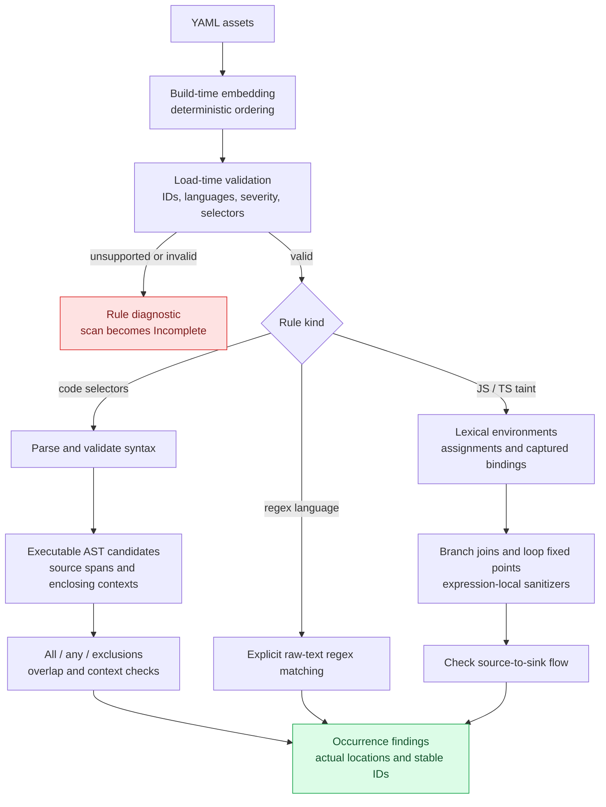

AST selectors avoid comment and string-only matches. Raw-text regex rules
deliberately include them. Taint tracking uses conservative joins, but it has no
general interprocedural summaries or precise dynamic alias model; its findings
are review signals rather than proof of exploitation.

## Database model

SQLite separates the current occurrence view from historical scan snapshots.
The schema below shows logical associations; these are not declared SQL foreign
key constraints. `findings.scan_id` identifies the last scan that observed an
occurrence and can contain a legacy identifier after migration.

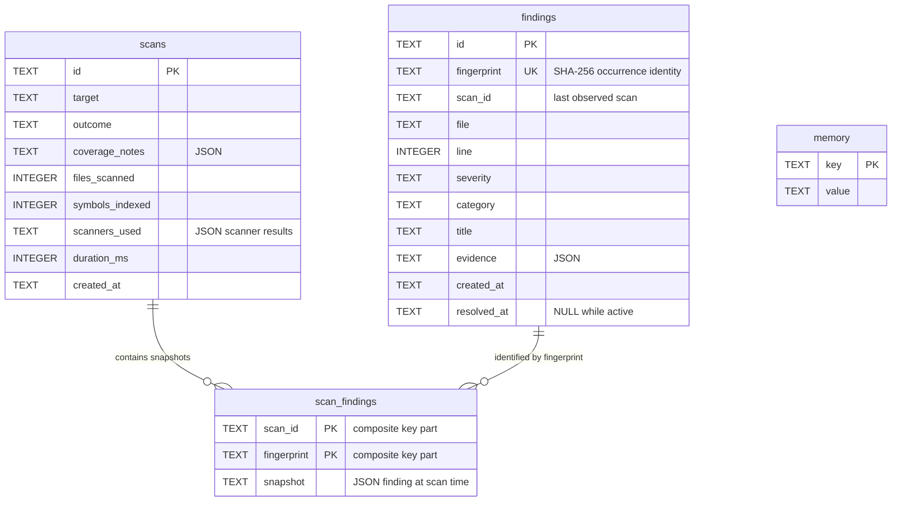

The findings table also stores confidence, description, execution path, affected
components, and recommendation; they are omitted from the diagram for clarity.
Schema v4 adds graph/index and baseline tables to this same store, as shown below.
Migration preserves legacy lifecycle metadata when present. A failed scan write
rolls back its scan record, finding updates, snapshots, and resolution changes.

## Finding lifecycle

Resolution requires both a complete scan and the appropriate file scope. An
existing file omitted from a full scan does not lose its active findings. A
reappearing fingerprint reactivates the current row while scan snapshots retain
the earlier observations.

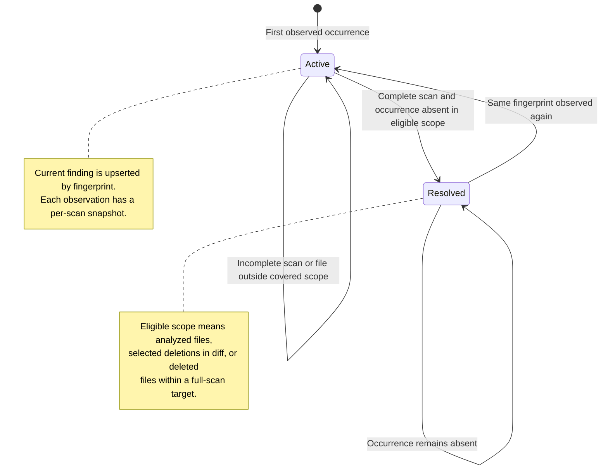

A changed path, line, category, rule title, or evidence creates a different
fingerprint. Resolution does not delete the current finding row or historical
snapshots. The threshold controls the CLI exit code, not persistence or lifecycle.

## Verification

```sh
cargo fmt --all -- --check
cargo check --workspace
cargo clippy --workspace --all-targets -- -D warnings
cargo test --workspace
```

The suite includes positive/negative fixtures for every bundled rule, taint
regressions, database upgrades, subprocess limits, and real CLI integration
checks for relocation, diff selection, persistence failures, lifecycle,
structured output, thresholds, and TUI EOF. CI runs the full workspace suite.
AI tests use local mock HTTP servers to verify identical messages, concurrent
dual-provider requests, explicit routing, partial failures, bearer authentication,
response validation, key redaction in diagnostics, and bounded context retrieval.
CLI checks verify side-effect-free context previews and finding-line excerpts.
These checks do not substitute for a live account/model integration test.

On Windows GNU toolchains, ensure the MinGW bin directory is on PATH so Cargo
can find gcc/dlltool and their libraries. The installed MinGW directory used
for local verification was C:\msys64\mingw64\bin. No machine-specific compiler
path is committed to the project.

## Terminal workspace

```sh
sentinel
# Or choose another project explicitly:
sentinel tui .
```

Running `sentinel` without arguments opens the TUI for the current directory.
Existing subcommands and `sentinel --help` remain available.

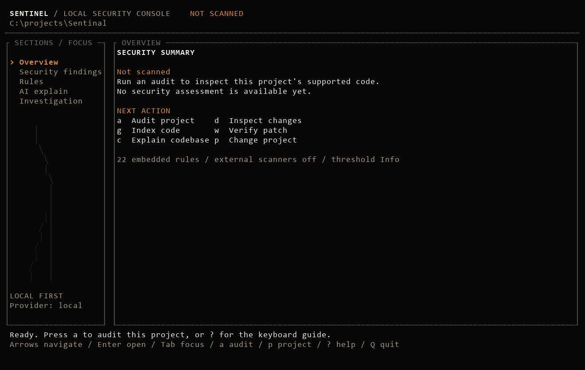

The fullscreen Ratatui interface uses a black marble background, restrained stone
veins in unused sidebar space, white text, orange actions, and beige metadata.
Persistent navigation opens five workspaces: Overview, Security findings,
Rules, Chat, and Investigation. Findings pair a selectable severity
list with location, confidence, execution path, evidence and remediation. The
Investigation view shows persistent index statistics and patch verdicts. The
overview distinguishes an unscanned project, incomplete coverage, findings needing
review, and no findings within the scanned scope. Operations
run in cancellable background processes, keeping navigation responsive.

| Key | Action |
| --- | --- |
| Tab / Shift+Tab | Switch between navigation and workspace focus |
| Arrows + Enter / 1-5 | Choose and open a section / open directly |
| a / d | Audit project / scan Git changes |
| g / w | Index security graph / verify patch |
| u / h / o | Latest audit coverage and freshness / 20 audit revisions / 20 persisted static jobs |
| j / k / arrows | Select finding or rule / scroll text |
| PageUp / PageDown / Home | Scroll evidence / reset |
| / / p / t | Filter findings / project path / exit threshold |
| x / v | Toggle external scanners / edit Semgrep config |
| s / S | Export JSON / SARIF to a new file |
| e / c | Explain selected finding / explain codebase |
| Alt+m / Alt+l / Alt+n in Chat | Provider / local model / NIM model |
| Alt+p / Alt+r in Chat | Toggle project evidence / start a new conversation |
| Alt+b / Enter in Chat | Preview the provider payload / send a message |
| ? / Esc / q or Q | Help / close, cancel, or return to navigation / quit |

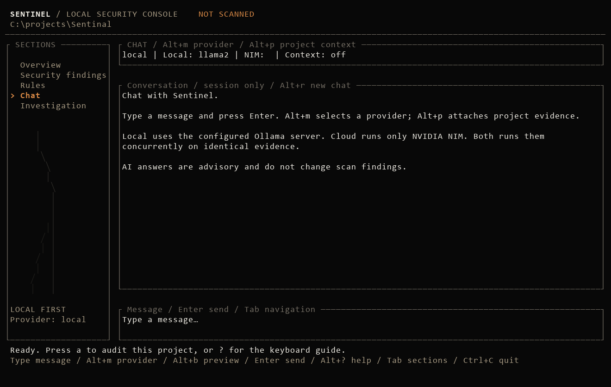

Chat accepts ordinary text without interpreting letters as command shortcuts.
It starts with project evidence off. `e` from Findings attaches that finding;
`c` from Overview prepares a codebase question. `Alt+p` toggles new project
evidence; existing conversation history is still sent, so use `Alt+r` to clear
it. `Alt+?` opens help and `Ctrl+C` quits while typing.

Conversation history lives only in memory, with up to 20 retained messages within
12 KB of serialized history. Older turns are dropped and long answers may be
shortened in the next request. Both providers receive the same retained history
and evidence. The chat cannot execute commands or modify files.

Local, NIM, and both are explicit choices with identical shared evidence in both
mode and no automatic fallback. AI output remains advisory. Resize support includes
an explicit compact-terminal message below 65 columns or 18 rows. Raw mode and the
alternate screen restore on exit/errors/panics. Redirected input/output retains
the simple line interface. The image is rendered from an actual styled test buffer.

## Evidence-based audit workflow

Use the bundled Cloudflare workflow with Sentinel's source evidence:

```sh
sentinel audit-workflow init /path/to/project --output /external/new-run
sentinel audit-workflow validate /path/to/project --run /external/new-run
sentinel audit-workflow import /path/to/project --run /external/new-run
sentinel audit-workflow status /path/to/project
```

Initialization seeds planned coverage; an agent performs the audit and independent
review. Validation/import require Node.js and reject stale source, invalid schemas,
unaccounted candidates, and missing confirmation attestations. Imported audits
remain separate from deterministic scan findings and patch gates. Press `u` in
the TUI to inspect the latest retained report and source freshness.

SQLite schema v7 retains content-addressed audit revisions and normalized coverage,
attempts, candidates and reviews in one import transaction. Legacy records remain
readable. Patch comparisons now include typed source manifests and candidate
evidence with detector identity; legacy baselines lacking provenance return WARN
until replaced with a reviewed fresh baseline.

See [the complete audit workflow guide](docs/audit-workflow.md) for skill export,
coverage contracts, review records, bounds and the execution isolation requirement.

## Security intelligence and agents

Sentinel also embeds a pinned Cloudflare security audit skill and its validators.
See [the audit workflow guide](docs/audit-workflow.md) for agent setup and evidence
requirements. The MCP server exposes thirteen tools, including audit workflow and
retained audit status queries.

```sh
sentinel index .
sentinel index-status .
sentinel mcp --repository .
```

Indexing persists definitions, stable symbol IDs, imports, resolved/unresolved
calls, sources, sinks, sanitizers, guards and flow evidence in `.sentinel.db`.
Changed files are reparsed; unchanged files reuse stored AST flow IR. All content
is still hashed and relationships recomputed to detect cross-file changes.
Deleted/invalid files invalidate stale graph entries. Statistics include timings,
changed/unchanged counts and explicit coverage notes. `index` exits 2 when partial.

Existing `audit` and `diff` retain their embedded per-file pipeline; `verify`
and the MCP service add persisted repository graph and interprocedural analysis.

The official Rust MCP SDK exposes ten repository-bound tools: index_project,
scan_file, scan_diff, get_security_context, trace_taint, explain_finding,
verify_patch, find_symbol, get_callers and get_callees (all prefixed `sentinel_`).
MCP stdout contains JSON-RPC only. No MCP security tool calls an LLM or executes an
agent-provided shell command. The agent edits code and asks Sentinel for evidence.

[Agent integration](docs/agent-integration.md) provides Codex, Claude Code,
Kilo CLI and OpenCode configuration examples, tool contracts and a before/after
editing workflow. [Implementation and boundaries](docs/security-intelligence-mvp.md)
describes supported constructs, persistent data, resource budgets and validation.

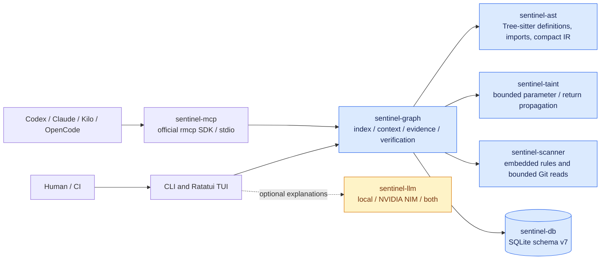

Security context ranks exact targets, same-file symbols, direct callers/callees,
imported modules, two-hop dependencies, source/sink/guard annotations, findings,
applicable rules, flow paths and changed files. Each item has a relevance score
and selection reasons; bounded outputs report omissions. A rule's applicability
or a guard's presence does not prove a vulnerability or protection.

Repository flow supports Python, JS/TS/TSX and basic Rust AST constructs. It
propagates arguments/returns across unambiguous local/imported calls; dynamic
receivers remain unresolved. Recognized SQL, shell, XSS and path sinks yield
location-based evidence, sanitizer steps, guard annotations and confidence.
It complements embedded-rule taint; it does not provide compiler-level soundness.
Unsupported constructs, parse failures and exhausted budgets affect coverage.

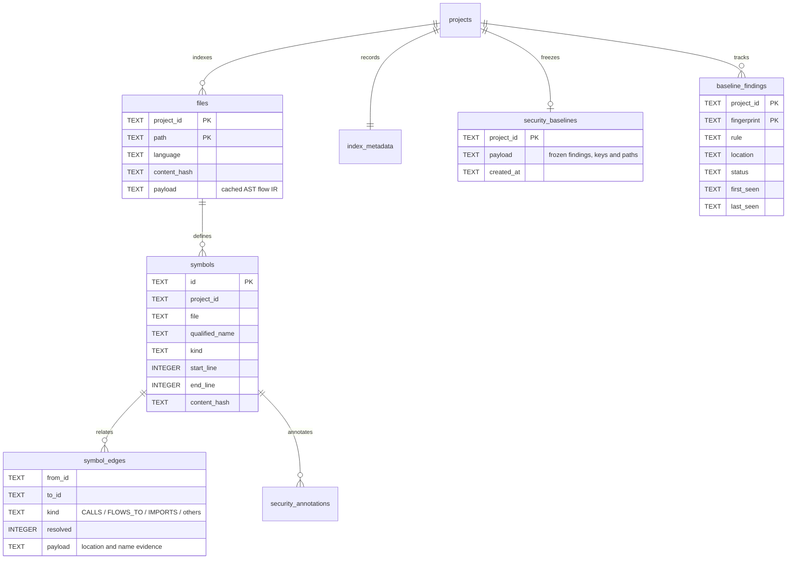

## Patch verification and baselines

```sh
# Freeze current findings as accepted debt; requires complete analysis.
sentinel baseline create .

# Prefer the saved baseline; otherwise compare against HEAD.
sentinel verify .

# Explicit immutable Git base, without checkout or executing project code.
sentinel verify . --base main
```

Verification returns JSON with NEW, RESOLVED, UNCHANGED and REGRESSED classifications
(as named finding arrays), changed flow paths, reasons, coverage and PASS/WARN/FAIL.
Git comparison analyzes changed files and call neighbors against a validated commit;
saved baselines compare the whole eligible project. Existing debt alone does not
fail. A complete verification records fixes so later reintroductions are regressed.

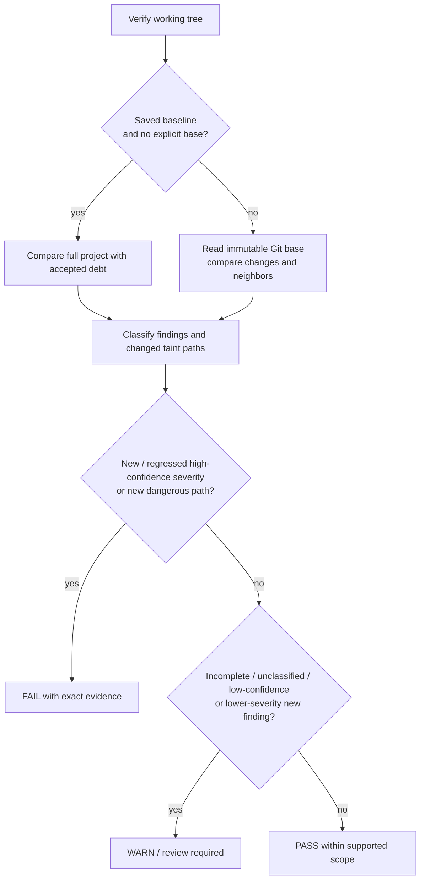

FAIL covers new/regressed high/critical findings with confidence at least 0.5,
or new medium-confidence dangerous paths. WARN covers lower severity, low
confidence and incomplete comparison. Incomplete evidence never returns PASS
and never establishes resolution. Verify exits 0 for complete PASS, 1 for complete
WARN/FAIL and 2 for incomplete analysis/errors (even when observed evidence fails).

Comparison identities ignore line shifts but include file paths and normalized
triggering source; semantic rewrites/renames can appear as new occurrences.
Baselines are tied to the canonical local repository root. This MVP is bounded
security evidence for review and controlled pilots, not an independently validated
proof that code is safe.

## Resumable static jobs

Create a persistent job with `sentinel job create /path/to/project`, then use its returned ID with `sentinel job resume ID --project /path/to/project --max-units 5`. Status and cancellation use `sentinel job status ID` and `sentinel job cancel ID` with the same project option. See [job scope and budget behavior](docs/static-jobs.md). These jobs do not execute target code or AI models.

Use `sentinel scan-file relative/file.py --project /path/to/project` for the same rule-plus-graph scan used by MCP. Audit revision metadata is available through `sentinel audit-workflow history` and the repository-bound `sentinel_get_audit_history` MCP tool.

Latest legacy audit records can be recovered with `sentinel audit-workflow export-legacy . --output <new-external-directory>`, then explicitly validated and imported. See [the recovery workflow](docs/audit-workflow.md#recover-the-latest-legacy-compatibility-record).

Phase 2 adds lexical/import aliases, supported Flask/FastAPI string route inputs, Express/Fastify ESM and CommonJS routes, Express Router handler aliases, bounded local Fastify plugins, object-field and branch precision, ordinary async returns, and source-bound trace provenance. The seven development corpora contain 68 cases; all pass their mapped rule scope. See [supported contracts](docs/framework-source-contracts.md) and [backend evaluation with remaining gates](docs/phase2-backend-evaluation.md). Independent accuracy and isolated Joern evaluation remain pending.

Local endpoints ending in `/v1` use OpenAI-compatible chat (LM Studio/Bionic).
Other local endpoints use Ollama `/api/chat`; flags/environment override defaults.
Local mode does not contact NVIDIA NIM.

NIM defaults to `z-ai/glm-5.3` with low reasoning effort and an 8,192-token
output budget. Set `NVIDIA_API_KEY` in your terminal to enable Cloud/Both.
Credentials are never embedded in configuration, source or documentation.

Sentinel loads launch-directory `.env`, then user-level `~/.sentinel/.env`,
without overriding process variables. `.env_example` contains
the supported AI settings; `.env` is git-ignored. Existing process variables
win. Only the five documented AI variables are admitted; other keys are ignored.
The API key is blank in newly generated templates until you fill it in.

Global AI configuration can live in `~/.sentinel/.env` (Windows:
`C:\Users\YOURNAME\.sentinel\.env`). Precedence is terminal environment, then
launch-directory `.env`, then user configuration. Generic chat includes directory
metadata but no source files; Alt+p attaches bounded project evidence.

For Qwen3.5 in Bionic, the loaded model must use a chat template with
`enable_thinking=false` for short interactive answers. On this installation the
Qwen model.yaml custom field default was set false (original backed up), and
Qwen was reloaded with 16K context and one prediction slot. Changing a chat's
system prompt alone does not necessarily affect server inference configuration.

Express/Fastify ESM module routes now recognize renamed request parameters and
inline/direct named handlers. Middleware and unsupported registration forms
remain explicitly incomplete. See [source contracts](docs/framework-source-contracts.md).
