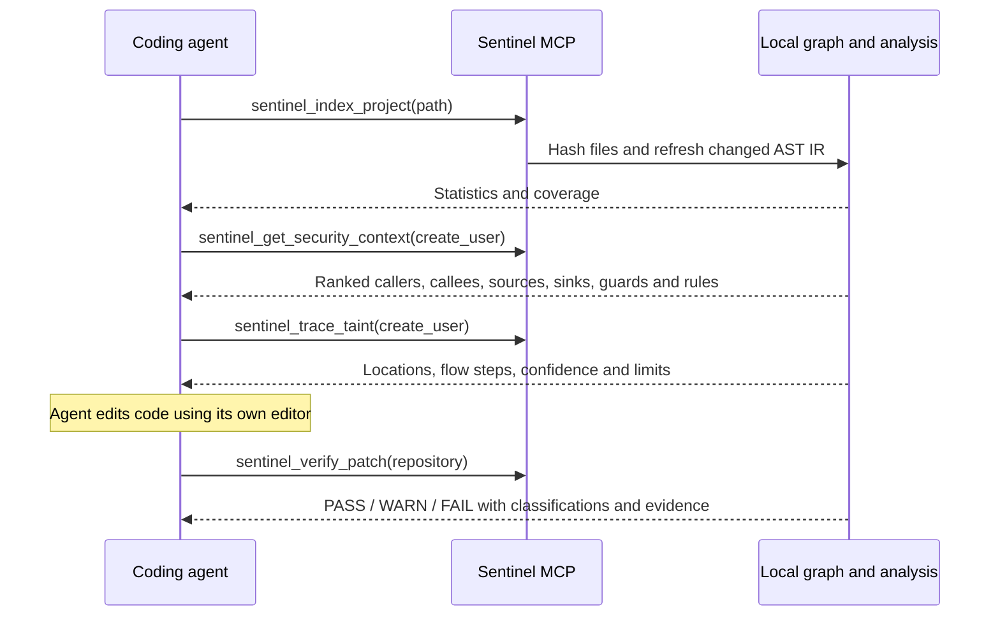

# Agent integration

Sentinel provides deterministic security evidence to coding agents over local
stdio MCP. No model, API key, external scanner, or network connection is needed
for its ten security tools. The agent remains responsible for editing code.

## Build and bind a repository

```sh
cargo build --release --bin sentinel
sentinel index /absolute/path/to/repository
sentinel mcp --repository /absolute/path/to/repository
```

Use the absolute executable path when configuring a client. On Windows, use
`C:/projects/Sentinal/target/release/sentinel.exe`; use an absolute path to the
repository being audited, which can differ from Sentinel's source repository.
Do not run the server manually alongside a client: the client starts its own
stdio process. stdout is JSON-RPC only; diagnostics use stderr. Closing stdin
shuts down the server. The official Rust SDK negotiates protocol versions.

## Codex

Add a local server in `~/.codex/config.toml`:

```toml
[mcp_servers.sentinel]
command = "C:/projects/Sentinal/target/release/sentinel.exe"
args = ["mcp", "--repository", "C:/projects/my-app"]
tool_timeout_sec = 120
```

Alternatively:

```sh
codex mcp add sentinel -- /absolute/path/to/sentinel mcp --repository /absolute/path/to/my-app
codex mcp list
```

Configuration shape and command syntax follow the
[official OpenAI documentation](https://learn.chatgpt.com/docs/extend/mcp?surface=cli).

## Claude Code

Register the native executable directly:

```sh
claude mcp add --transport stdio sentinel -- /absolute/path/to/sentinel mcp --repository /absolute/path/to/my-app
```

A project `.mcp.json` example:

```json
{
  "mcpServers": {
    "sentinel": {
      "type": "stdio",
      "command": "C:/projects/Sentinal/target/release/sentinel.exe",
      "args": ["mcp", "--repository", "C:/projects/my-app"]
    }
  }
}
```

See [Claude Code's MCP guide](https://code.claude.com/docs/en/mcp).

## Kilo CLI

Add this entry to your project `kilo.jsonc` (merge with existing settings):

```json
{
  "mcp": {
    "sentinel": {
      "type": "local",
      "command": ["C:/projects/Sentinal/target/release/sentinel.exe", "mcp", "--repository", "C:/projects/my-app"],
      "enabled": true,
      "timeout": 120000
    }
  }
}
```

This uses the current Kilo CLI configuration format, documented in
[Kilo's MCP guide](https://kilo.ai/docs/automate/mcp/using-in-kilo-code).

## OpenCode

Add this entry to project `opencode.json`:

```json
{
  "$schema": "https://opencode.ai/config.json",
  "mcp": {
    "sentinel": {
      "type": "local",
      "command": ["C:/projects/Sentinal/target/release/sentinel.exe", "mcp", "--repository", "C:/projects/my-app"],
      "enabled": true,
      "timeout": 120000
    }
  }
}
```

See [OpenCode's local MCP configuration](https://opencode.ai/docs/mcp-servers/).
These examples have been checked against client documentation; live registration
in all four clients has not been tested. The server itself has an end-to-end
stdio test covering discovery and every tool.

## Suggested coding-agent workflow



Use this instruction in your agent's project guidance:

> Before changing a security-sensitive function, retrieve Sentinel security
> context and inspect its sources, sinks, callers, sanitizers and guard evidence.
> Investigate relevant flows with trace_taint. After editing, call verify_patch.
> Cite rule IDs and file locations. Treat incomplete coverage and low confidence
> as review requirements; never claim a clean security result from them.

Example `tools/call` arguments:

```json
{"name":"sentinel_get_security_context","arguments":{"repository":".","target":"create_user","max_items":40}}
```

```json
{"name":"sentinel_trace_taint","arguments":{"repository":".","target":"create_user","sink_type":"sql-injection","max_call_depth":8,"max_paths":64,"max_nodes_visited":10000}}
```

```json
{"name":"sentinel_verify_patch","arguments":{"repository":".","base":"HEAD"}}
```

Targets accept symbol IDs, names, qualified names, repository-relative files,
in-repository absolute paths, and `file:line`. Context also accepts `diff`.
An omitted verification `base` uses a saved baseline when present, otherwise HEAD.
An explicit base always selects Git. Git comparisons require the configured root
to be the Git repository root. Saved-baseline verification can work without Git.

## Tool contracts

| Tool | Purpose |
| --- | --- |
| sentinel_index_project | Incremental index statistics, timings and coverage |
| sentinel_scan_file | Embedded rules plus cross-function taint; persist findings |
| sentinel_scan_diff | Compare changed files and call neighbors to HEAD/ref |
| sentinel_get_security_context | Ranked, bounded security evidence with reasons |
| sentinel_trace_taint | Potential source-to-sink paths, confidence and limits |
| sentinel_explain_finding | Deterministic WHAT/WHERE/WHY/FLOW/EVIDENCE/FIX for a persisted ID |
| sentinel_verify_patch | Verdict, new/resolved/unchanged/regressed findings and flows |
| sentinel_find_symbol | Search names, IDs, files and locations |
| sentinel_get_callers | Incoming calls and caller symbols |
| sentinel_get_callees | Outgoing calls; unresolved dynamic names remain explicit |

Context includes freshly derived graph-flow findings alongside existing stored
occurrences. For explain_finding, first persist the occurrence through scan_file
or audit.
Historical findings remain explainable when their current source is unavailable.
Structured results appear in `structuredContent` and mirrored JSON text. Tool
failures set `isError` and return an error object. No tool accepts a shell command.
Indexing and scans write only the local SQLite store; verification updates saved
baseline lifecycle metadata after complete analysis. No security tool changes
repository source, checks out Git commits, or calls an LLM.

## Limits and interpretation

`max_items` is 1-200; targets are capped at 512 bytes. Trace limits are call depth
1-32, paths 1-200, nodes 1-100000 (defaults 8/64/10000). Origin joins retain 32
unique source/sanitizer states and diagnose overflow. MCP results are capped at
4 MiB; narrow the target when the server reports an oversized response.

Context scores prioritize exact targets, source/sink evidence, related findings,
applicable rules, and direct call neighbors. Each selected item gives reasons;
omitted_count describes retrieval truncation. Applicability is not a rule hit.
Guard annotations are syntactic evidence, not a proof of authorization dominance.
Dynamic calls, complex aliases, closures, exceptions, and framework-specific
semantics can require review. Inspect coverage_notes and complete before using
any verdict as a gate. Optional Ollama/NIM explanations are CLI/TUI features;
they never create or overrule deterministic MCP findings.
