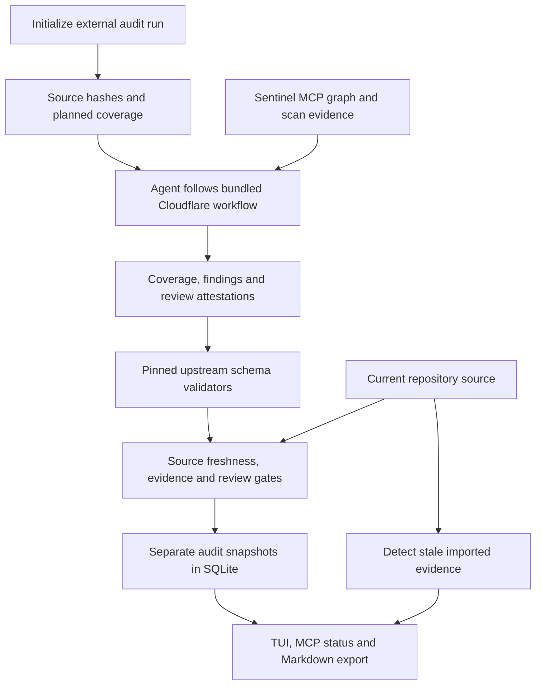

# Evidence-based audit workflow

Sentinel bundles an unmodified copy of Cloudflare's MIT-licensed
[security-audit-skill](https://github.com/cloudflare/security-audit-skill) at commit
`c1c8a8c1471069fb0e188eeaff69b8e8db6564a8`. The adapter, schemas, companion guidance,
and validators are embedded in the executable and survive binary relocation.
[Provenance](../crates/sentinel-graph/audit-skill/PROVENANCE.json) records the revision;
the upstream license is retained alongside the files.

This adds an audit workflow around Sentinel's deterministic engine. It does not
start agents, contact an AI provider, run audited code, or provide a sandbox.
The existing `sentinel audit` scan and patch verification commands retain their
meaning. Imported audit verdicts cannot promote or suppress deterministic findings.

## Start and use a run

Node.js is required for validation and import. Indexing, run initialization, skill
export, status, and report export do not require Node. Set `SENTINEL_AUDIT_NODE` to
an executable path if Node is not on PATH. This is an explicit runtime selection,
not an automatic download or installation.

The output parent must already exist. Run directories must be new and outside the
audited repository; existing directories and files are never overwritten.

```sh
sentinel audit-workflow init /projects/my-app --output /audits/my-app-run-1
# Optionally include normally excluded files in the snapshot:
sentinel audit-workflow init /projects/my-app --output /audits/my-app-run-2 --include Cargo.lock --include .github/workflows/ci.yml

sentinel audit-workflow validate /projects/my-app --run /audits/my-app-run-1
sentinel audit-workflow import /projects/my-app --run /audits/my-app-run-1
sentinel audit-workflow status /projects/my-app
sentinel audit-workflow report /projects/my-app --output /audits/REPORT.md
```

Windows example:

```powershell
sentinel audit-workflow init C:/projects/my-app --output C:/audits/my-app-run-1
```

The run contains source metadata, an index summary, a planned coverage ledger,
empty findings/review records, a reconnaissance document, and the exported skill
under `skill/`. The ledger initially contains one planned unit per indexed file.
Reconnaissance must replace its generic boundaries and attack class and add
missing surfaces, lifecycle modes, and relevant companion attack classes.
No seeded unit is marked reviewed or covered.

Ask your coding agent to use the generated `skill/SKILL.md` with Sentinel's MCP
server bound to the target. The agent coordinates Cloudflare's reconnaissance,
hunting, candidate validation, record verification, and reporting phases. The
parent is the sole owner of shared run files. Delegation requires an available,
authorized agent mechanism; without independent review, a candidate cannot be
confirmed. This integration does not automatically install a skill in every agent.

For an agent's chosen skill directory, export to a new folder:

```sh
sentinel audit-workflow skill --output /my-agent/skills/sentinel-security-audit
```

## What validation establishes

The import pipeline uses the pinned upstream validators' exported functions against
bounded JSON supplied over stdin. It does not load scripts from the run directory,
use upstream's platform-dependent file-opening CLI, or execute artifact payloads.
This permits the same schema checks on Windows. The helper has a 128 MiB V8 heap,
a 30-second deadline, an environment allowlist, and bounded output. It is a trusted
validator process, not an OS sandbox for untrusted target execution.

Native gates also check repository/revision provenance, current source hashes,
coverage-to-finding links, source paths and line numbers, unfinished coverage,
and review attestations for confirmed findings. Combined imported records are
limited to 2 MiB. Input files must be regular, bounded files within the external
run directory. Source snapshots are limited to 2000 selected files, 1 MiB/file,
and 16 MiB total. Sentinel's ignored/hidden, generated, binary, and lockfile
exclusions apply unless a file is explicitly included. Snapshot scope is visible;
excluded surfaces are not implicitly audited.

The unchanged findings contract distinguishes:

- `confirmed`: source trace, impact, remediation, reproduction, and observed result.
- `needs_validation`: a source-grounded lead with a precise blocker and validation
  plan; no severity field.
- `rejected`: a disproved candidate with source evidence and a rejection reason.

Coverage units remain distinct from vulnerability verdicts. `run_status: complete`
is rejected while planned or in-progress units remain. Blocked, deferred,
out-of-scope, or candidate units are still reported as partial coverage. A complete
workflow never means that the repository has no vulnerabilities.

For each confirmed fingerprint, `verification.json` must record:

```json
[
  {
    "fingerprint": "a-source-derived-fingerprint",
    "discoverer": "hunter-1",
    "verifier": "verifier-1",
    "source_snapshot": "copy-from-run-metadata",
    "method": "sandboxed-local",
    "observed_result": "must match findings execution.observed_result exactly",
    "sandbox": {
      "network_disabled": true,
      "environment_allowlisted": true,
      "read_only_target": true,
      "scratch_only_writes": true,
      "resource_limited": true,
      "limits": "Record actual CPU, memory, process, disk and time bounds."
    }
  }
]
```

These are producer attestations. Schema validation cannot authenticate reviewer
identities, prove that a sandbox existed, or establish that an exploit happened.
The report and TUI preserve that distinction. Use `needs_validation` when decisive
execution cannot be performed under Cloudflare's required OS-enforced controls.
Do not fabricate these records to pass an import gate.

Source checks are best-effort snapshots, not atomic filesystem snapshots. Keep the
run and repository under trusted ownership and quiescent during validation/import.
They are not a containment boundary against concurrent hostile filesystem mutation.

## MCP, TUI and retention

The server now exposes twelve tools. `sentinel_get_audit_workflow` provides the
adapter; `sentinel_get_audit_status` returns the latest imported run, coverage and
finding counts, notes, and source freshness. These tools accept no external output
path and cannot read arbitrary external run directories. Artifact validation and
import are explicit CLI operations.

Press **u** in the TUI to inspect the retained audit in the Intelligence view.
Changed, added, removed, newly excluded, or unreadable selected source makes the
retained report stale. A new run must revalidate the evidence; historical recorded
confirmations are not silently carried forward.

Schema v5 retains validated imports as content-addressed `audit_revisions` with
normalized `audit_coverage`, `audit_attempts`, `audit_candidates`, and `audit_reviews`
rows. `audit_latest` identifies the current revision for the project. Imports are
transactional: a failure cannot advance the latest pointer or partially publish
records. Identical imports are idempotent; changed content under the same run ID
creates another retained revision. Records are application-immutable, not
tamper-proof against someone who can edit the database.

Compatibility memory keys `audit-workflow.run.<run-id>` and
`audit-workflow.latest.v1` are updated in the same transaction. Migration preserves
legacy values and status can still read them. Old records are not automatically
promoted into normalized validated revisions; reimport a freshly validated run to
populate the new tables. Existing finding, graph and baseline data is preserved.
The CLI/MCP/TUI currently expose the latest imported run. Upstream
prior-run synthesis remains an agent workflow over external run directories,
not an automatic merger or agent scheduler in Sentinel.

List retained revision metadata with `sentinel audit-workflow history /path/to/project --limit 20`
(limit 1–100). It reports content identity, run, timestamp and latest pointer, with
`has_more` for truncated results. It does not revalidate historical source freshness;
use `status` for the current imported report.



## Retained JSON artifact descriptors

`sentinel audit-workflow artifacts <revision-id> --project <repository>` returns
four metadata descriptors for the retained run metadata, coverage ledger, findings
and verification records. Obtain a revision ID with `audit-workflow history`.
The command is repository-bound and accepts a 64-character hexadecimal revision ID.

Each descriptor records schema version, revision, logical filename, JSON media type,
serialization encoding, SHA-256 content identity, byte size, source snapshot and
`validated-import-attestation` provenance. Hashes and sizes describe Sentinel's
normalized JSON serialization, **not original file bytes**. Descriptors for new
imports are committed atomically with the revision in SQLite schema v7. Schema v6
upgrades preserve revisions; old descriptors are derived from retained payloads
without requiring the original audit directory. Stored descriptors are checked
against their retained payload before being returned.

These descriptors do not fetch or execute referenced files, preserve arbitrary
reproduction artifacts, authenticate reviewers, or establish observed execution.
`execution_observed` is always false for these imported records. Source freshness
must be checked separately. General reproduction artifact intake and containment
remain roadmap work.

Once a database upgrades to v7, older v6 binaries reject it; use the updated build.

## Recover the latest legacy compatibility record

```powershell
sentinel audit-workflow export-legacy . --output C:\audit-runs\recovered
sentinel audit-workflow validate . --run C:\audit-runs\recovered
sentinel audit-workflow import . --run C:\audit-runs\recovered
```

The output parent must already exist; the run directory must be new and outside
the target repository. Export reads only the latest `audit-workflow.latest.v1`
compatibility record, preserving its metadata and evidence. It does not claim
validation, update history, alter the legacy memory value, or manufacture provenance.
The compatibility record can also have been written by a recent normalized import.
Records exceeding the 2 MiB bound or belonging to another repository are rejected.
Normal validation/import rejects stale source and unsupported schema/provenance.
A stale recovery should be retained as historical evidence and a new audit started;
do not replace its snapshot identity to force validation. Historical per-run memory
keys are not batch migrated by this command.
