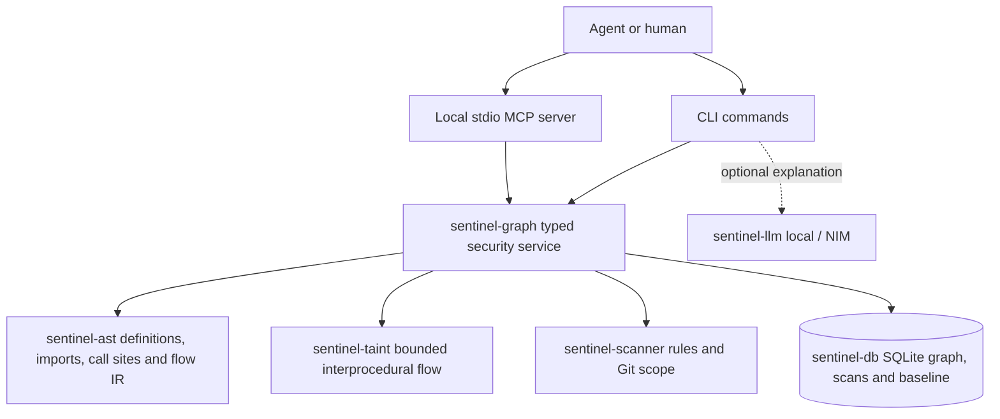

# Security intelligence MVP

Product thesis: **Deterministic security intelligence for humans and AI coding agents.**

## Repository audit

The workspace already has reusable parsing, rules, persistence, and reporting:

| Crate | Existing responsibility | Reuse in the MVP |
| --- | --- | --- |
| sentinel-core | Serializable findings, severity, coverage, SHA-256 occurrence identity | Shared graph, trace, context, and verification contracts |
| sentinel-ast | Tree-sitter Rust/Python/JS/TS/TSX parsing, validation, file walking, symbols | AST-derived definitions, imports, calls, and compact flow IR |
| sentinel-taint | JS/TS lexical data flow, branches, loop joins, sanitizers | Retain existing rules; add bounded cross-function interpretation of AST flow IR |
| sentinel-scanner | Embedded validated rules, offline pipeline, optional bounded external adapters | Rule evaluation and shared Git selection |
| sentinel-db | SQLite schema v6, transactional scan snapshots, graph, baseline and audit revisions | Preserve history while extending evidence storage |
| sentinel-llm | Optional Ollama/NIM explanations on shared lexical context | Keep optional; no LLM is needed for any MCP security conclusion |
| sentinel-report | Terminal, JSON, SARIF | Existing scan outputs remain compatible |
| sentinel-cli | audit, diff, rules, explain, explain-codebase, Ratatui TUI | Add index, index-status, verify, baseline, and stdio MCP |

The MVP now implements a persistent symbol/call graph, bounded repository taint,
ranked security context, baseline lifecycle, patch verification, and thirteen stdio MCP
tools. Existing audits and provider-independent AI explanations remain available.
The TUI exposes audit, diff, index, verify, rule inspection and AI explanations.

## Implemented architecture



`sentinel-graph` owns indexing, resolution, security retrieval, deterministic
evidence, and patch verification. `sentinel-mcp` adapts this service to the official
Rust MCP SDK (`rmcp`), with typed tool inputs and structured JSON results. SQLite
stays the only persistent store. MCP stdout is reserved for protocol messages.
No tool executes arbitrary agent-provided commands or calls a model by default.

## Persistence and indexing

A versioned migration adds `projects`, `files`, `symbols`, `symbol_edges`,
`security_annotations`, and `index_metadata`. Files store content hashes and AST
IR. Stable symbol IDs use project, relative file, lexical qualified name, and
kind, so moving a function's line does not change its identity. Changed files are
reparsed; unchanged files reuse persisted IR. Relationship resolution can be
recomputed from cached call sites without reparsing unchanged source. Deleted or
invalid files invalidate their stale graph entries; coverage errors are explicit.

Schema v4 also adds `security_baselines` and `baseline_findings`. Entries retain
logical fingerprints, rule names, locations, statuses, and first/last seen
timestamps. Versioned migrations preserve existing scans, finding lifecycle and
graph data. Future schema versions are rejected.

Schema v5 adds normalized audit revisions, latest pointers, coverage, attempts,
candidates and reviews. See [audit storage](audit-workflow.md) for import and legacy
compatibility. Patch assessments include source-manifest identities, detector/rule
provenance and typed candidate evidence. Candidate assessment is independent of
occurrence lists (new, unchanged, resolved, regressed); static matches remain
`needs_validation`. Legacy baselines deserialize without fabricated manifests and
cannot produce a provenance-backed PASS. Source disagreements between indexed
graph and assessed rule text make comparison incomplete.

## Analysis boundaries

MVP languages: Python, JavaScript/TypeScript, and Rust parsing. Cross-function
flow is bounded and approximate; it is not compiler-level soundness. Recognized
source/sink/sanitizer/guard names are deterministic annotations, not proof of
runtime identity or authorization dominance. Ambiguous/unresolved calls are
reported and must not be silently promoted to proven relationships. Traversal
limits and skipped syntax appear in coverage diagnostics, and incomplete analysis
must not produce an unconditional PASS verdict.

## MCP tools

| Tool | Input | Structured result |
| --- | --- | --- |
| sentinel_index_project | path | Index statistics and coverage |
| sentinel_scan_file | path | Findings, rule evidence, and completion |
| sentinel_scan_diff | repository, optional base | New, resolved, unchanged findings and flow changes |
| sentinel_get_security_context | repository, target, max_items | Ranked symbols, neighbors, annotations, rules, findings and paths |
| sentinel_trace_taint | repository, target, optional sink, limits | Bounded paths, confidence, evidence, sanitizers and guards |
| sentinel_explain_finding | finding_id | WHAT / WHERE / WHY / FLOW / EVIDENCE / FIX |
| sentinel_verify_patch | repository, optional base | PASS / WARN / FAIL, classifications and coverage |
| sentinel_find_symbol | repository, query | Matching symbols and locations |
| sentinel_get_callers | repository, target | Incoming resolved call relationships |
| sentinel_get_callees | repository, target | Outgoing resolved call relationships |

Each server is bound to its configured repository. Requests outside that root,
including symlink escapes, are rejected. Return short location-based evidence,
not whole-repository source blobs. The SDK handles protocol version negotiation.

## Delivery order and validation

1. P0: typed graph and versioned storage; incremental AST indexing.
2. P0: bounded cross-function taint and ranked security context.
3. P0: stdio MCP tools and end-to-end JSON-RPC tests.
4. P1: deterministic Git verification, baseline and regression classifications.
5. P1: explainable evidence, fixture repositories, agent setup documentation.
6. Complete the earlier TUI request on top of the resulting service.

Verify graph edges, unchanged-file reuse, stale-edge removal, recursion limits,
cross-file flows, sanitizer behavior, guard annotations, MCP schemas and stdio,
new/existing/resolved/regressed findings, migrations, and terminal rendering.
Run formatting, workspace tests, strict Clippy, and release build. Record actual
measurements for index, incremental updates, scans, graph queries, and traces.

## Commands and verdicts

```sh
sentinel index .
sentinel index-status .
sentinel baseline create .
sentinel verify .
sentinel verify . --base HEAD
sentinel mcp --repository .
sentinel tui .
```

Git verification reads an immutable commit without checking it out. It compares
changed files (including untracked/deleted files) and direct call neighbors from
both graphs; taint is traced over both repository snapshots and filtered by the
affected scope. Saved baselines assess the entire eligible project to distinguish
accepted debt from new and reintroduced findings. A complete verification records
observed fixes so a later reappearance is REGRESSED. Baseline creation refuses
incomplete evidence. Recreating a baseline explicitly accepts current debt.

PASS means no new regressions within supported coverage. FAIL means new/regressed
high or critical findings with confidence >= 0.5, or new medium-confidence
unblocked dangerous paths. WARN means lower severity, low confidence, unclassified
findings, or incomplete evidence. Existing unchanged debt alone does not fail.
Verification exits 0 for complete PASS, 1 for complete WARN/FAIL, and 2 for
incomplete analysis or errors; an incomplete report can still contain FAIL
because an observed dangerous regression needs remediation.

Stable comparison keys ignore line shifts and use path, rule/category and
normalized triggering source; interprocedural hits use a stable flow ID. Renaming
a file or substantially rewriting a triggering statement can appear as a new
occurrence. Baseline tracking is local to the canonical repository path. These
identities are heuristic, not a semantic equivalence proof.

## Resource bounds and coverage

Indexing considers up to 2000 eligible code files, 1 MiB per source and 16 MiB
in total. Parsing security IR is bounded to 20000 named AST nodes and depth 128
per file. Unchanged files reuse serialized IR; content still must be read/hashed,
and relationships and paths are rebuilt from cached evidence. SQLite transactions
replace a graph snapshot atomically. Skipped/invalid files invalidate stale rows.

Python/JS/TS/TSX and Rust definitions/imports are supported. Flow extraction models
simple assignments, category-specific sanitizers, local/imported calls, parameters,
returns, lexical blocks, branch joins and bounded loops. Python decorators identify
routes and guards. HTML assignments, SQL query strings, shell commands and file
path sinks are recognized syntactically. Guard/API identity is not runtime proof.
Unsupported exception/switch/match/destructuring semantics diagnose incomplete
coverage. Go is not supported by this security IR. Reflection, dispatch, package
resolution, precise object fields, closure capture and async concurrency require
manual review. Do not infer compiler-level soundness from a complete report.

Graph nodes comprise symbols and annotations; edges include DEFINES, IMPORTS,
CALLS, READS_FROM, WRITES_TO, FLOWS_TO, GUARDED_BY and SANITIZED_BY. Unresolved edges
preserve names. Annotation relationships show recognized syntax, not proven control
flow dominance. No embedding service, vector database, or generic chat layer is
required.

## Validation assets

`fixtures/vulnerable-demo` contains cross-file SQL and shell flows, XSS and file
paths. `fixtures/safe-demo` includes bound SQL, escaped HTML and authentication /
authorization annotations. `fixtures/patch-regression-demo` documents baseline,
fix and reintroduction. Fixtures are never executed. Rust tests cover persisted
edges, incremental reuse/deletions, line-stable identity, aliases, returns,
sanitizers, shadowing, HTML assignment, limits, unsupported constructs, baseline
verdicts, schema upgrades, every MCP tool and edit/verify over actual stdio.

TUI tests render all five views at four sizes, exercise keyboard/edit behavior,
and export a styled terminal buffer for visual review. Redirected stdin/stdout
retains the simple line interface. External client configuration examples are in
[agent-integration.md](agent-integration.md).
## Measured local latency

One reproducible Windows debug-build run on a generated 122-file Python project
(604 symbols, one cross-file SQL path) measured:

| Operation | Wall time |
| --- | ---: |
| First persistent index | 146 ms |
| Unchanged refresh | 30 ms |
| One changed-file refresh | 44 ms |
| File scan with repository flow | 51 ms |
| Ranked context query | 82 ms |
| Targeted trace | 43 ms |

Query/trace timings include their automatic index refresh. These are single-run
engineering measurements, not a production performance guarantee or detection
benchmark. Reproduce with:

```sh
cargo test -p sentinel-graph --test graph security_service_latency_measurement -- --ignored --nocapture
```

Source walking and Git selection share exclusions for generated directories and
known binary assets (including the SQLite store and its sidecars). Unknown or
unreadable text inputs remain coverage errors. Git reads disable external diffs,
text conversion and filesystem-monitor hooks so repository configuration cannot
turn a comparison into execution of a project-defined helper.
